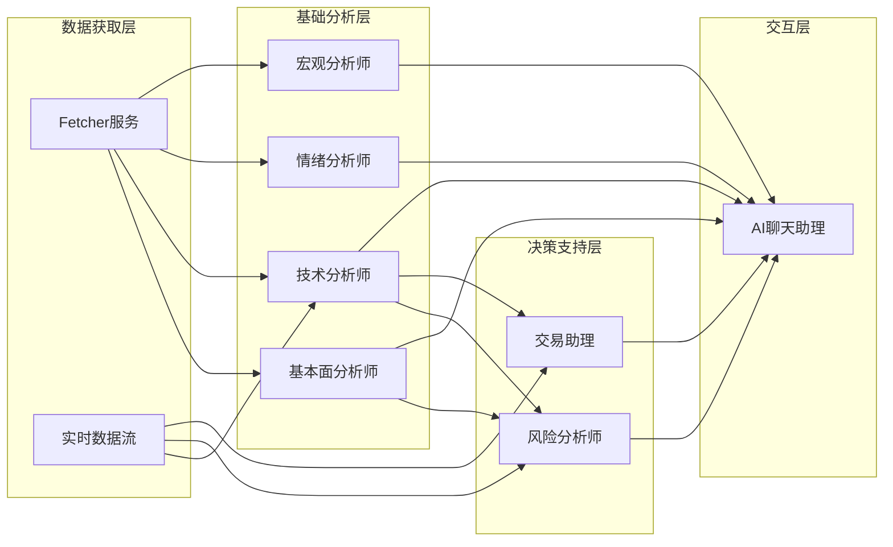
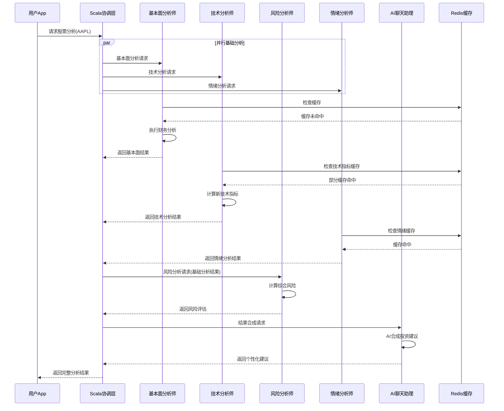

# 金融AI Agents协调与数据流设计

## 服务协调架构

### 1. Scala协调层设计

```scala
// Scala主服务中的Agent协调器
package app.mosia.agents

import akka.actor.typed.{ActorRef, ActorSystem, Behavior}
import akka.actor.typed.scaladsl.Behaviors
import akka.util.Timeout
import scala.concurrent.{ExecutionContext, Future}
import scala.concurrent.duration._
import java.util.UUID

case class AgentCoordinatorConfig(
  fundamentalAnalystUrl: String,
  technicalAnalystUrl: String, 
  riskAnalystUrl: String,
  sentimentAnalystUrl: String,
  macroAnalystUrl: String,
  tradeAssistantUrl: String,
  chatAssistantUrl: String,
  parallelAnalysisTimeout: FiniteDuration = 30.seconds,
  maxConcurrentRequests: Int = 10
)

class FinancialAgentOrchestrator(
  config: AgentCoordinatorConfig,
  grpcClients: Map[String, FinancialAgentsServiceClient]
)(implicit ec: ExecutionContext, system: ActorSystem[_]) {

  implicit val timeout: Timeout = Timeout(config.parallelAnalysisTimeout)

  /**
   * 获取综合投资分析 - 并行调用多个Agent
   */
  async def getComprehensiveAnalysis(
    userId: String,
    symbols: List[String],
    portfolioId: Option[String] = None,
    analysisOptions: AnalysisOptions
  ): Future[ComprehensiveAnalysisResult] = {
    
    val analysisId = UUID.randomUUID().toString
    logger.info(s"开始综合分析 analysisId=$analysisId, symbols=$symbols")
    
    try {
      // 1. 并行执行基础分析
      val basicAnalysisFutures = symbols.map { symbol =>
        Future.traverse(Seq(
          ("fundamental", () => analyzeFundamental(userId, symbol, analysisOptions)),
          ("technical", () => analyzeTechnical(userId, symbol, analysisOptions)),
          ("sentiment", () => analyzeSentiment(userId, symbol, analysisOptions))
        )) { case (analystType, analysisFunc) =>
          analysisFunc().map(analystType -> _).recover {
            case ex => 
              logger.warn(s"$analystType 分析失败: ${ex.getMessage}")
              analystType -> AnalysisFailure(ex.getMessage)
          }
        }.map(symbol -> _.toMap)
      }
      
      // 2. 并行执行组合级分析
      val portfolioAnalysisFuture = portfolioId match {
        case Some(pid) => analyzeRisk(userId, pid, analysisOptions).map(Some(_))
        case None => Future.successful(None)
      }
      
      val macroAnalysisFuture = analyzeMacroEnvironment(userId, symbols.head, analysisOptions)
      
      // 3. 等待所有分析完成
      for {
        basicResults <- Future.sequence(basicAnalysisFutures)
        portfolioRisk <- portfolioAnalysisFuture
        macroContext <- macroAnalysisFuture
      } yield {
        
        // 4. 综合结果并生成最终建议
        val combinedResults = CombinedAnalysisResults(
          symbolAnalyses = basicResults.toMap,
          portfolioRisk = portfolioRisk,
          macroContext = macroContext,
          analysisId = analysisId,
          generatedAt = Instant.now()
        )
        
        // 5. 通过聊天助理生成最终投资建议
        val finalAdvice = await(synthesizeInvestmentAdvice(userId, combinedResults))
        
        ComprehensiveAnalysisResult(
          analysisId = analysisId,
          symbolAnalyses = basicResults.toMap,
          portfolioAnalysis = portfolioRisk,
          macroAnalysis = macroContext,
          investmentAdvice = finalAdvice,
          executionStrategy = generateExecutionStrategy(finalAdvice),
          metadata = AnalysisMetadata(
            processingTimeMs = (System.currentTimeMillis() - startTime).toInt,
            dataQualityScore = calculateDataQuality(combinedResults),
            analystParticipation = Map(
              "fundamental" -> basicResults.exists(_._2.contains("fundamental")),
              "technical" -> basicResults.exists(_._2.contains("technical")),
              "risk" -> portfolioRisk.isDefined,
              "sentiment" -> basicResults.exists(_._2.contains("sentiment")),
              "macro" -> true
            )
          )
        )
      }
      
    } catch {
      case ex: Exception =>
        logger.error(s"综合分析失败 analysisId=$analysisId", ex)
        throw AgentCoordinationException(s"分析协调失败: ${ex.getMessage}", ex)
    }
  }

  /**
   * 实时推荐流 - 基于事件触发
   */
  def startRealtimeRecommendationStream(
    userId: String, 
    watchlist: List[String]
  ): Source[RecommendationUpdate, NotUsed] = {
    
    // Kafka事件源
    val priceUpdates = KafkaConsumer.plainSource(
      ConsumerSettings(system, new StringDeserializer, new StringDeserializer)
        .withBootstrapServers("kafka:29092")
        .withGroupId(s"realtime-recommendations-$userId"),
      Subscriptions.topics("financial.prices.realtime")
    ).map(_.value())
    
    val newsUpdates = KafkaConsumer.plainSource(
      ConsumerSettings(system, new StringDeserializer, new StringDeserializer)
        .withBootstrapServers("kafka:29092")
        .withGroupId(s"news-updates-$userId"),
      Subscriptions.topics("financial.news")
    ).map(_.value())
    
    // 合并事件流
    Source.merge(Seq(priceUpdates, newsUpdates))
      .filter(event => isRelevantToUser(event, userId, watchlist))
      .mapAsync(config.maxConcurrentRequests) { event =>
        processRealtimeEvent(userId, event, watchlist)
      }
      .collect { case Some(update) => update }
  }

  private async def processRealtimeEvent(
    userId: String, 
    event: String, 
    watchlist: List[String]
  ): Future[Option[RecommendationUpdate]] = {
    
    val eventData = parseEventData(event)
    
    eventData.eventType match {
      case "price_change" if eventData.priceChangePercent.abs > 0.05 => // 5%以上变动
        // 触发快速技术分析
        val quickTechAnalysis = await(grpcClients("technical").analyzeTechnical(
          TechnicalAnalysisRequest(
            userId = userId,
            symbols = Seq(eventData.symbol),
            timeframe = "1m",
            indicators = Seq("rsi", "macd"),
            options = AnalysisOptions(outputDetail = "summary")
          )
        ))
        
        Some(RecommendationUpdate(
          updateId = UUID.randomUUID().toString,
          updateType = "technical_signal",
          affectedSymbols = Seq(eventData.symbol),
          message = s"${eventData.symbol} 价格异动 ${eventData.priceChangePercent:+.2%}",
          priority = if (eventData.priceChangePercent.abs > 0.10) Priority.HIGH else Priority.NORMAL,
          data = UpdateData.withTechnicalSignal(quickTechAnalysis.signals.head),
          timestamp = Instant.now()
        ))
        
      case "breaking_news" if eventData.sentimentImpact.abs > 0.3 => // 重大新闻
        // 触发快速情绪分析
        val sentimentAnalysis = await(grpcClients("sentiment").analyzeSentiment(
          FinancialSentimentRequest(
            userId = userId,
            symbols = eventData.affectedSymbols,
            sources = Seq("news"),
            options = AnalysisOptions(outputDetail = "summary")
          )
        ))
        
        Some(RecommendationUpdate(
          updateId = UUID.randomUUID().toString,
          updateType = "news_event", 
          affectedSymbols = eventData.affectedSymbols,
          message = s"重大新闻影响: ${eventData.headline}",
          priority = Priority.HIGH,
          data = UpdateData.withNewsAlert(NewsAlert(
            headline = eventData.headline,
            sentimentImpact = eventData.sentimentImpact,
            source = eventData.source,
            affectedSymbols = eventData.affectedSymbols,
            summary = sentimentAnalysis.symbolSentiments.head.breakdown.toString
          )),
          timestamp = Instant.now()
        ))
        
      case _ => None // 不重要的事件，忽略
    }
  }

  /**
   * 个性化建议合成
   */
  private async def synthesizeInvestmentAdvice(
    userId: String,
    combinedResults: CombinedAnalysisResults
  ): Future[InvestmentAdvice] = {
    
    // 获取用户投资偏好
    val userProfile = await(getUserInvestmentProfile(userId))
    
    // 调用聊天助理进行智能合成
    val chatRequest = InvestmentChatRequest(
      userId = userId,
      sessionId = s"synthesis_${combinedResults.analysisId}",
      message = "请基于以下多维分析结果，生成个性化投资建议",
      contextType = "comprehensive_analysis",
      contextData = Map(
        "fundamental_results" -> combinedResults.symbolAnalyses.toString,
        "technical_signals" -> combinedResults.technicalSignals.toString,
        "risk_assessment" -> combinedResults.portfolioRisk.toString,
        "macro_context" -> combinedResults.macroContext.toString,
        "user_profile" -> userProfile.toString
      )
    )
    
    val chatResponse = await(grpcClients("chat").processInvestmentChat(chatRequest))
    
    // 解析聊天助理的建议
    InvestmentAdvice(
      userId = userId,
      analysisId = combinedResults.analysisId,
      advice = chatResponse.response,
      recommendations = extractRecommendations(chatResponse),
      riskWarnings = extractRiskWarnings(chatResponse),
      executionSteps = extractExecutionSteps(chatResponse),
      confidence = calculateOverallConfidence(combinedResults),
      validUntil = Instant.now().plusSeconds(3600) // 1小时有效
    )
  }

  /**
   * 交易执行策略生成
   */
  private async def generateExecutionStrategy(
    advice: InvestmentAdvice
  ): Future[ExecutionStrategy] = {
    
    val tradeIntents = advice.recommendations.map { rec =>
      TradeIntent(
        symbol = rec.symbol,
        action = rec.action.toString,
        targetValue = calculatePositionValue(rec),
        orderType = "limit", // 默认限价单
        urgency = determineUrgency(rec)
      )
    }
    
    // 为每个交易意图获取执行建议
    val executionAdvices = await(Future.traverse(tradeIntents) { intent =>
      grpcClients("trade").getTradeAdvice(TradeAdviceRequest(
        userId = advice.userId,
        tradeIntent = intent,
        currentPortfolio = getCurrentPortfolio(advice.userId), // 需要实现
        marketConditions = getCurrentMarketConditions(intent.symbol) // 需要实现
      ))
    })
    
    ExecutionStrategy(
      analysisId = advice.analysisId,
      totalEstimatedCost = executionAdvices.map(_.costAnalysis.totalCost).sum,
      recommendedExecutionOrder = optimizeExecutionOrder(executionAdvices),
      riskManagement = generateRiskManagement(executionAdvices),
      expectedExecutionTime = calculateTotalExecutionTime(executionAdvices)
    )
  }
}

// Actor系统中的事件处理
object RealtimeEventProcessor {
  
  sealed trait Command
  case class ProcessPriceUpdate(symbol: String, priceData: PriceData) extends Command
  case class ProcessNewsEvent(newsData: NewsData) extends Command
  case class ProcessAnalysisResult(result: AnalysisResult) extends Command
  
  def apply(): Behavior[Command] = Behaviors.setup { context =>
    
    val orchestrator = new FinancialAgentOrchestrator(config, grpcClients)
    
    Behaviors.receiveMessage {
      case ProcessPriceUpdate(symbol, priceData) =>
        context.log.debug(s"处理价格更新: $symbol -> ${priceData.currentPrice}")
        
        // 检查是否触发分析阈值
        if (shouldTriggerAnalysis(symbol, priceData)) {
          context.spawn(
            AnalysisActor(symbol, priceData, orchestrator),
            s"analysis-$symbol-${System.currentTimeMillis()}"
          )
        }
        
        Behaviors.same
        
      case ProcessNewsEvent(newsData) =>
        context.log.debug(s"处理新闻事件: ${newsData.headline}")
        
        // 触发相关股票的情绪分析
        newsData.affectedSymbols.foreach { symbol =>
          context.spawn(
            SentimentAnalysisActor(symbol, newsData, orchestrator),
            s"sentiment-$symbol-${System.currentTimeMillis()}"
          )
        }
        
        Behaviors.same
        
      case ProcessAnalysisResult(result) =>
        context.log.debug(s"处理分析结果: ${result.analysisId}")
        
        // 更新缓存和通知用户
        updateAnalysisCache(result)
        notifyInterestedUsers(result)
        
        Behaviors.same
    }
  }
  
  private def shouldTriggerAnalysis(symbol: String, priceData: PriceData): Boolean = {
    // 价格变动超过5%触发分析
    math.abs(priceData.priceChangePercent) > 0.05 ||
    // 成交量异常放大
    priceData.volumeRatio > 2.0 ||
    // 突破重要技术位
    priceData.breakoutSignal.isDefined
  }
}
```

### 2. Python Agent基础框架

```python
# agent基础类
from abc import ABC, abstractmethod
from typing import Dict, Any, List, Optional
from dataclasses import dataclass
from datetime import datetime
import asyncio
import logging

@dataclass
class AnalysisContext:
    """分析上下文"""
    user_id: str
    symbols: List[str]
    analysis_depth: str
    time_range: Optional[tuple] = None
    user_preferences: Optional[Dict] = None
    market_conditions: Optional[Dict] = None

@dataclass
class AnalysisResult:
    """分析结果基类"""
    analyst_type: str
    symbol: str
    confidence: float
    analysis_data: Dict[str, Any]
    generated_at: datetime
    valid_until: Optional[datetime]
    data_sources: List[str]
    processing_time_ms: int

class BaseFinancialAnalyst(ABC):
    """金融分析师基类"""
    
    def __init__(self, analyst_type: str):
        self.analyst_type = analyst_type
        self.logger = logging.getLogger(f"{analyst_type}_analyst")
        self.cache = None  # Redis缓存客户端
        self.db = None     # 数据库连接池
        
    async def initialize(self):
        """初始化分析师服务"""
        await self._setup_cache()
        await self._setup_database()
        await self._load_models()
        await self._setup_data_sources()
        
    @abstractmethod
    async def analyze(self, context: AnalysisContext) -> AnalysisResult:
        """执行分析 - 子类必须实现"""
        pass
        
    @abstractmethod
    async def get_real_time_signals(self, symbols: List[str]) -> List[Dict]:
        """获取实时信号 - 子类必须实现"""
        pass
        
    async def _setup_cache(self):
        """设置缓存连接"""
        import aioredis
        self.cache = aioredis.from_url(
            f"redis://{os.getenv('REDIS_HOST')}:{os.getenv('REDIS_PORT')}"
        )
        
    async def _setup_database(self):
        """设置数据库连接"""
        import asyncpg
        self.db = await asyncpg.create_pool(
            os.getenv('DB_URL'),
            min_size=5,
            max_size=20
        )
        
    @abstractmethod
    async def _load_models(self):
        """加载AI模型 - 子类实现"""
        pass
        
    @abstractmethod  
    async def _setup_data_sources(self):
        """设置数据源连接 - 子类实现"""
        pass
        
    async def get_cached_analysis(
        self, 
        cache_key: str, 
        ttl_seconds: int = 1800
    ) -> Optional[AnalysisResult]:
        """获取缓存的分析结果"""
        try:
            cached_data = await self.cache.get(cache_key)
            if cached_data:
                return AnalysisResult.from_json(cached_data)
        except Exception as e:
            self.logger.warning(f"缓存读取失败: {e}")
        return None
        
    async def cache_analysis(
        self, 
        cache_key: str, 
        result: AnalysisResult, 
        ttl_seconds: int = 1800
    ):
        """缓存分析结果"""
        try:
            await self.cache.setex(
                cache_key, 
                ttl_seconds, 
                result.to_json()
            )
        except Exception as e:
            self.logger.warning(f"缓存写入失败: {e}")
```

## 数据流处理设计

### 1. 实时数据流处理

```python
# 实时事件处理器
class FinancialEventProcessor:
    """金融事件流处理器"""
    
    def __init__(self):
        self.event_handlers = {
            'price_update': self._handle_price_update,
            'news_event': self._handle_news_event,
            'earnings_announcement': self._handle_earnings,
            'analyst_rating_change': self._handle_rating_change,
            'macro_data_release': self._handle_macro_data
        }
        
    async def start_processing(self):
        """启动事件流处理"""
        # Kafka消费者配置
        consumer_config = {
            'bootstrap_servers': 'kafka:29092',
            'group_id': f'{self.analyst_type}-event-processor',
            'auto_offset_reset': 'latest',
            'enable_auto_commit': True
        }
        
        # 并行处理多个topic
        tasks = [
            self._process_topic('financial.prices.realtime', self._handle_price_update),
            self._process_topic('financial.news', self._handle_news_event),
            self._process_topic('financial.earnings', self._handle_earnings),
            self._process_topic('financial.macro', self._handle_macro_data)
        ]
        
        await asyncio.gather(*tasks)
        
    async def _process_topic(self, topic: str, handler):
        """处理特定topic的消息"""
        from aiokafka import AIOKafkaConsumer
        
        consumer = AIOKafkaConsumer(
            topic,
            bootstrap_servers='kafka:29092',
            group_id=f'{self.analyst_type}-{topic}',
            auto_offset_reset='latest'
        )
        
        await consumer.start()
        try:
            async for message in consumer:
                try:
                    event_data = json.loads(message.value.decode('utf-8'))
                    await handler(event_data)
                except Exception as e:
                    self.logger.error(f"处理事件失败: {e}")
                    # 继续处理，不中断流
        finally:
            await consumer.stop()
            
    async def _handle_price_update(self, event_data: Dict):
        """处理价格更新事件"""
        symbol = event_data['symbol']
        price_change = event_data['price_change_percent']
        
        # 价格异动阈值检查
        if abs(price_change) > 0.05:  # 5%以上变动
            # 触发技术分析更新
            await self._trigger_technical_analysis_update(symbol, event_data)
            
            # 更新风险指标
            await self._trigger_risk_metric_update(symbol, event_data)
            
            # 检查用户告警条件
            await self._check_price_alerts(symbol, event_data)
            
    async def _handle_news_event(self, event_data: Dict):
        """处理新闻事件"""
        headline = event_data['headline']
        affected_symbols = event_data.get('affected_symbols', [])
        sentiment_score = event_data.get('sentiment_score', 0)
        
        # 重大新闻处理
        if abs(sentiment_score) > 0.6:  # 情绪影响显著
            # 触发情绪分析更新
            for symbol in affected_symbols:
                await self._trigger_sentiment_analysis_update(symbol, event_data)
                
            # 如果是系统性新闻，触发宏观分析
            if event_data.get('scope') == 'market_wide':
                await self._trigger_macro_analysis_update(event_data)
```

### 2. 数据同步和一致性

```python
# 数据同步管理器
class DataSynchronizationManager:
    """数据同步管理器"""
    
    def __init__(self):
        self.sync_intervals = {
            'financial_data': 3600,      # 1小时
            'price_data': 60,            # 1分钟
            'news_data': 300,            # 5分钟
            'macro_data': 86400,         # 1天
            'analyst_reports': 1800      # 30分钟
        }
        
    async def start_sync_tasks(self):
        """启动所有同步任务"""
        tasks = []
        
        for data_type, interval in self.sync_intervals.items():
            task = asyncio.create_task(
                self._periodic_sync(data_type, interval)
            )
            tasks.append(task)
            
        await asyncio.gather(*tasks)
        
    async def _periodic_sync(self, data_type: str, interval: int):
        """周期性数据同步"""
        while True:
            try:
                await self._sync_data_type(data_type)
                await asyncio.sleep(interval)
            except Exception as e:
                self.logger.error(f"数据同步失败 {data_type}: {e}")
                await asyncio.sleep(60)  # 错误后等待1分钟再试
                
    async def _sync_data_type(self, data_type: str):
        """同步特定类型数据"""
        sync_methods = {
            'financial_data': self._sync_financial_data,
            'price_data': self._sync_price_data,
            'news_data': self._sync_news_data,
            'macro_data': self._sync_macro_data,
            'analyst_reports': self._sync_analyst_reports
        }
        
        method = sync_methods.get(data_type)
        if method:
            await method()
            
    async def _sync_financial_data(self):
        """同步财务数据"""
        # 获取需要更新的股票列表
        symbols_to_update = await self._get_stale_financial_data()
        
        # 批量获取最新财务数据
        for batch in self._batch_symbols(symbols_to_update, batch_size=10):
            try:
                financial_data = await self._fetch_financial_data_batch(batch)
                await self._update_financial_cache(financial_data)
                await self._trigger_fundamental_analysis_refresh(batch)
            except Exception as e:
                self.logger.error(f"财务数据同步失败 {batch}: {e}")
```

### 3. 智能缓存策略

```python
# 多层缓存策略
class IntelligentCacheManager:
    """智能缓存管理器"""
    
    def __init__(self):
        self.cache_layers = {
            'l1': 'redis',      # 热点数据，毫秒级
            'l2': 'database',   # 温数据，秒级  
            'l3': 'object_storage'  # 冷数据，分钟级
        }
        
        # 缓存策略配置
        self.cache_strategies = {
            'real_time_prices': {
                'ttl': 30,           # 30秒
                'layer': 'l1',
                'refresh_strategy': 'write_through'
            },
            'technical_indicators': {
                'ttl': 300,          # 5分钟
                'layer': 'l1', 
                'refresh_strategy': 'write_behind'
            },
            'fundamental_analysis': {
                'ttl': 1800,         # 30分钟
                'layer': 'l2',
                'refresh_strategy': 'lazy_refresh'
            },
            'historical_data': {
                'ttl': 86400,        # 24小时
                'layer': 'l3',
                'refresh_strategy': 'scheduled_refresh'
            }
        }
    
    async def get_with_strategy(
        self, 
        cache_key: str, 
        data_type: str,
        fetch_func=None
    ):
        """根据策略获取缓存数据"""
        strategy = self.cache_strategies.get(data_type)
        if not strategy:
            return await fetch_func() if fetch_func else None
            
        # L1缓存检查
        if strategy['layer'] in ['l1']:
            cached_data = await self._get_from_redis(cache_key)
            if cached_data:
                return cached_data
                
        # L2缓存检查
        if strategy['layer'] in ['l2']:
            cached_data = await self._get_from_database(cache_key)
            if cached_data and not self._is_stale(cached_data, strategy['ttl']):
                # 异步回写到L1
                asyncio.create_task(self._write_to_redis(cache_key, cached_data, strategy['ttl']))
                return cached_data
        
        # 缓存未命中，获取新数据
        if fetch_func:
            fresh_data = await fetch_func()
            
            # 根据策略写入缓存
            if strategy['refresh_strategy'] == 'write_through':
                await self._write_through_cache(cache_key, fresh_data, strategy)
            elif strategy['refresh_strategy'] == 'write_behind':  
                asyncio.create_task(self._write_behind_cache(cache_key, fresh_data, strategy))
                
            return fresh_data
            
        return None
        
    async def invalidate_related_cache(self, symbol: str, event_type: str):
        """智能缓存失效"""
        invalidation_rules = {
            'price_change': [
                f"technical:{symbol}:*",
                f"risk:portfolio:*:{symbol}",
                f"realtime:alerts:{symbol}"
            ],
            'earnings_release': [
                f"fundamental:{symbol}:*", 
                f"sentiment:{symbol}:*",
                f"recommendations:{symbol}:*"
            ],
            'news_event': [
                f"sentiment:{symbol}:*",
                f"recommendations:{symbol}:*"
            ]
        }
        
        patterns = invalidation_rules.get(event_type, [])
        for pattern in patterns:
            await self._invalidate_pattern(pattern)
```

## Agent间协作模式

### 1. 依赖关系图



### 2. 协作时序图



### 3. 事件驱动更新机制

```python
# 事件驱动分析触发器
class AnalysisTriggerManager:
    """分析触发管理器"""
    
    def __init__(self):
        self.trigger_rules = {
            # 价格变动触发规则
            'price_change': {
                'threshold': 0.03,  # 3%价格变动
                'affected_analysts': ['technical', 'risk'],
                'analysis_type': 'quick_update',
                'priority': 'high'
            },
            
            # 新闻事件触发规则
            'news_event': {
                'sentiment_threshold': 0.4,
                'affected_analysts': ['sentiment', 'risk'],
                'analysis_type': 'sentiment_update',
                'priority': 'medium'
            },
            
            # 财报发布触发规则
            'earnings_release': {
                'affected_analysts': ['fundamental', 'sentiment', 'risk'],
                'analysis_type': 'comprehensive_refresh',
                'priority': 'high',
                'delay_seconds': 1800  # 等待30分钟数据稳定
            },
            
            # 宏观数据发布触发规则
            'macro_release': {
                'affected_analysts': ['macro', 'risk'],
                'analysis_type': 'macro_refresh', 
                'priority': 'medium',
                'batch_processing': True  # 批量处理相关标的
            }
        }
        
    async def process_trigger_event(self, event: Dict):
        """处理触发事件"""
        event_type = event['event_type']
        trigger_rule = self.trigger_rules.get(event_type)
        
        if not trigger_rule:
            return
            
        # 检查触发条件
        if not await self._check_trigger_conditions(event, trigger_rule):
            return
            
        # 确定受影响的分析师
        affected_analysts = trigger_rule['affected_analysts']
        
        # 确定分析范围
        affected_symbols = self._determine_affected_symbols(event, trigger_rule)
        
        # 创建分析任务
        analysis_tasks = []
        for analyst in affected_analysts:
            task = self._create_analysis_task(
                analyst=analyst,
                symbols=affected_symbols,
                analysis_type=trigger_rule['analysis_type'],
                priority=trigger_rule['priority'],
                trigger_event=event
            )
            analysis_tasks.append(task)
        
        # 提交到任务队列
        await self._submit_analysis_tasks(analysis_tasks)
        
    async def _check_trigger_conditions(self, event: Dict, rule: Dict) -> bool:
        """检查触发条件"""
        event_type = event['event_type']
        
        if event_type == 'price_change':
            return abs(event['price_change_percent']) >= rule['threshold']
        elif event_type == 'news_event':
            return abs(event.get('sentiment_impact', 0)) >= rule['sentiment_threshold']
        elif event_type == 'earnings_release':
            return True  # 财报总是触发分析
        elif event_type == 'macro_release':
            return event.get('importance', 'low') in ['medium', 'high']
            
        return False
        
    def _determine_affected_symbols(self, event: Dict, rule: Dict) -> List[str]:
        """确定受影响的股票代码"""
        event_type = event['event_type']
        
        if event_type == 'macro_release':
            # 宏观事件影响特定行业
            affected_sectors = event.get('affected_sectors', [])
            return self._get_symbols_by_sectors(affected_sectors)
        else:
            return event.get('symbols', [event.get('symbol')])
            
    async def _submit_analysis_tasks(self, tasks: List[Dict]):
        """提交分析任务到队列"""
        # 根据优先级排序
        tasks.sort(key=lambda x: {'high': 3, 'medium': 2, 'low': 1}[x['priority']], reverse=True)
        
        # 提交到Kafka任务队列
        producer = AIOKafkaProducer(bootstrap_servers='kafka:29092')
        await producer.start()
        
        try:
            for task in tasks:
                topic = f"analysis.tasks.{task['analyst']}"
                message = json.dumps(task).encode('utf-8')
                await producer.send_and_wait(topic, message)
                
        finally:
            await producer.stop()
```

### 4. 性能优化策略

```python
# 性能优化管理器
class PerformanceOptimizer:
    """性能优化管理器"""
    
    def __init__(self):
        self.analysis_queue = asyncio.Queue(maxsize=1000)
        self.batch_processor = None
        self.load_balancer = LoadBalancer()
        
    async def optimize_analysis_requests(self, requests: List[AnalysisRequest]):
        """优化分析请求处理"""
        
        # 1. 请求去重
        deduplicated = self._deduplicate_requests(requests)
        
        # 2. 批量优化
        batched_requests = self._optimize_batching(deduplicated)
        
        # 3. 负载均衡
        distributed_requests = await self._distribute_load(batched_requests)
        
        # 4. 并行处理
        results = await self._parallel_process(distributed_requests)
        
        return results
        
    def _deduplicate_requests(self, requests: List[AnalysisRequest]) -> List[AnalysisRequest]:
        """请求去重"""
        seen = set()
        deduplicated = []
        
        for req in requests:
            request_key = f"{req.analyst_type}:{req.symbol}:{req.analysis_type}"
            if request_key not in seen:
                seen.add(request_key)
                deduplicated.append(req)
                
        return deduplicated
        
    def _optimize_batching(self, requests: List[AnalysisRequest]) -> Dict[str, List[AnalysisRequest]]:
        """请求批量化优化"""
        batches = {}
        
        for request in requests:
            analyst_type = request.analyst_type
            
            if analyst_type not in batches:
                batches[analyst_type] = []
                
            batches[analyst_type].append(request)
            
            # 当批量大小达到阈值时，创建新批次
            if len(batches[analyst_type]) >= 10:
                batch_id = f"{analyst_type}_{len(batches)}"
                batches[batch_id] = batches[analyst_type]
                batches[analyst_type] = []
                
        return batches
```

这个设计文档详细展示了：

1. **Scala协调层**的核心逻辑，包括并行分析协调、实时事件处理、结果合成等
2. **Python Agent基础架构**，提供统一的分析师框架和扩展机制
3. **数据流处理策略**，包括实时事件处理、数据同步、缓存管理等
4. **Agent间协作模式**，明确依赖关系和交互时序
5. **性能优化策略**，确保高并发下的系统稳定性

这个架构支持高度并行的分析处理，通过事件驱动机制确保实时性，同时提供了完整的容错和性能优化方案。