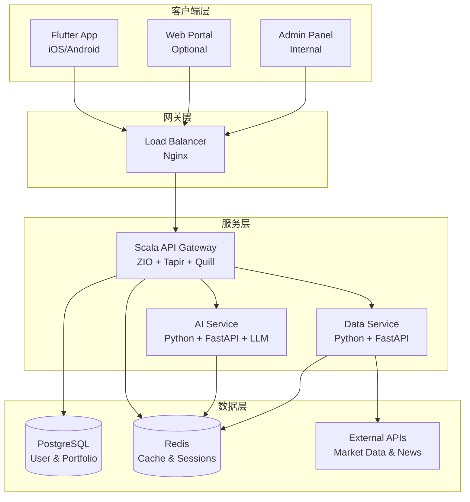
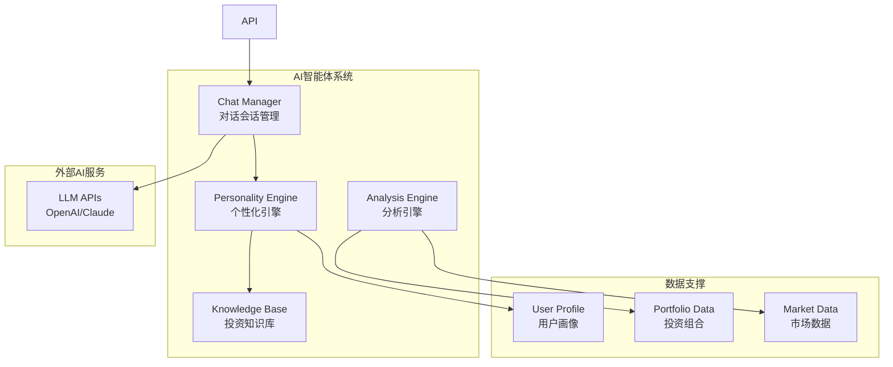
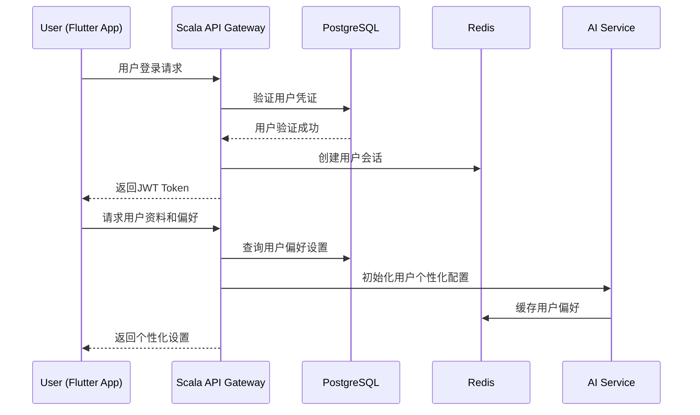
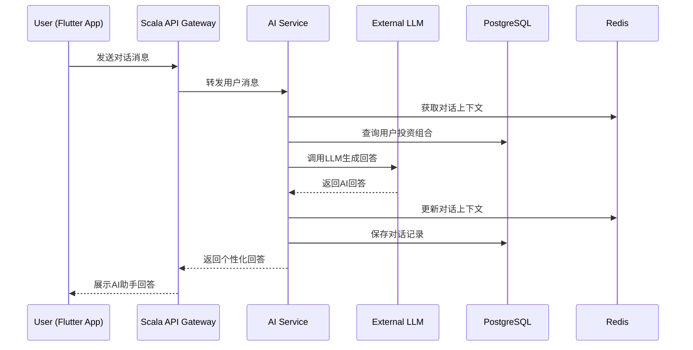
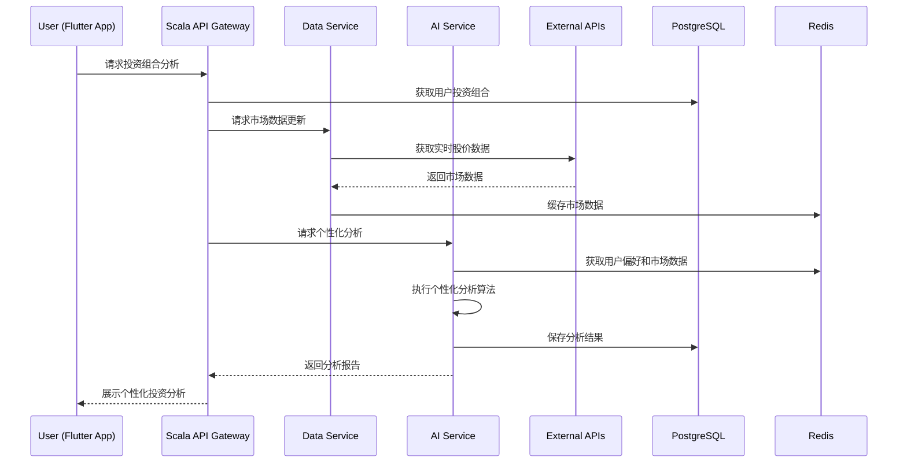

# 📘 Mosia系统架构说明书

**文档版本**: v2.0  
**更新时间**: 2025-08-24  
**文档状态**: 基于战略定位和MVP规划的完整架构设计

## 1. 系统概述

### 1.1 产品定位
**Mosia** 是一个专为华人投资者设计的 **个性化AI投资智能体平台**。

**核心差异化价值**：
- **简化复杂性**: 将富途等复杂平台的功能过载转化为简单易懂的个性化指导
- **AI驱动**: 朋友式的主动AI投资助手，而非被动的数据展示工具
- **华人专属**: 针对在美华人投资者的跨境投资需求和文化偏好设计
- **教育导向**: 在提供投资分析的同时逐步提升用户投资知识

### 1.2 市场战略
**"由外向内"市场策略**：
1. **美国起步**: 服务在美华人投资者群体
2. **海外验证**: 建立品牌声誉和产品验证
3. **中国进入**: 利用海外成功案例进入中国大陆市场

### 1.3 合规策略
**"纯信息服务"模式**：
- ✅ 投资组合数据分析和可视化
- ✅ 市场信息整合和教育内容
- ✅ 基于客观数据的统计分析
- ❌ 具体股票推荐和买卖建议
- ❌ 投资收益承诺和担保

### 1.4 核心系统目标
- **AI智能体服务**: 个性化的朋友式投资助手对话系统
- **数据整合分析**: 多源投资数据的智能整合和分析
- **用户成长伴随**: 随用户投资经验成长的交互进化
- **安全合规运营**: 严格遵循美国金融服务合规要求  


## 2. 系统架构图（更新版）

### 2.1 整体架构图


### 2.2 AI智能体架构图

## 3. 系统时序图（更新版）

### 3.1 用户登录和初始化流程


### 3.2 AI对话交互流程


### 3.3 投资组合分析流程


## 4. 模块详细说明

### 4.1 前端层 (Flutter App)

#### 技术栈
- **框架**: Flutter 3.x + Dart
- **状态管理**: Provider / Riverpod 
- **网络请求**: Dio + Retrofit
- **本地存储**: SharedPreferences + SQLite

#### 核心功能模块
- **用户认证模块**: 注册、登录、个人资料管理
- **AI对话界面**: 实时聊天、消息渲染、语音输入(未来)
- **投资组合管理**: 持仓输入、组合展示、数据编辑
- **分析结果展示**: 图表可视化、个性化洞察展示
- **设置和偏好**: 通知设置、AI个性化配置、语言切换

#### 用户体验特性
- **双语支持**: 中英文无缝切换，符合华人用户习惯
- **离线能力**: 关键数据本地缓存，弱网环境下的基础功能
- **推送通知**: AI主动提醒的本地推送集成
- **响应式设计**: 适配不同尺寸设备的界面布局

### 4.2 API网关层 (Scala Service)

#### 技术栈
- **语言**: Scala 3.x
- **框架**: ZIO 2.x + ZIO-HTTP + Tapir
- **数据库**: Quill (PostgreSQL ORM)
- **认证**: JWT + OAuth2
- **缓存**: ZIO-Redis

#### 核心职责
- **用户管理**: 注册、登录、认证、权限控制
- **API路由**: RESTful API的统一入口和路由管理
- **请求代理**: 前端请求到后端微服务的智能路由
- **数据聚合**: 多个微服务数据的整合和返回
- **安全控制**: 请求验证、权限检查、数据脱敏

#### 关键API端点
```scala
// 用户认证相关
POST /api/auth/register      // 用户注册
POST /api/auth/login         // 用户登录  
POST /api/auth/refresh       // Token刷新
GET  /api/auth/profile       // 用户资料

// 投资组合管理
GET    /api/portfolio        // 获取用户投资组合
POST   /api/portfolio/holding // 添加持仓
PUT    /api/portfolio/holding/{id} // 更新持仓
DELETE /api/portfolio/holding/{id} // 删除持仓

// AI对话接口  
POST /api/ai/chat            // 发送对话消息
GET  /api/ai/sessions        // 获取对话历史
GET  /api/ai/analysis        // 获取投资分析结果
```

### 4.3 AI智能体服务 (Python Service)

#### 技术栈
- **框架**: FastAPI + Pydantic + Asyncio
- **AI集成**: OpenAI API / Claude API / Langchain
- **数据处理**: Pandas + NumPy + Scikit-learn
- **缓存**: Redis-py + AsyncIO Redis

#### 核心模块

##### ChatManager (对话管理器)
```python
class ChatManager:
    """负责AI对话的会话管理和上下文维护"""
    
    async def process_message(self, user_id: str, message: str) -> str:
        # 获取对话上下文
        context = await self.get_conversation_context(user_id)
        
        # 生成个性化回答
        response = await self.generate_response(message, context)
        
        # 更新对话历史
        await self.update_conversation_history(user_id, message, response)
        
        return response
```

##### PersonalityEngine (个性化引擎)
```python
class PersonalityEngine:
    """基于用户特征调整AI交互风格"""
    
    def adapt_communication_style(self, user_profile: dict) -> dict:
        # 根据用户投资经验调整复杂度
        # 根据风险偏好调整建议风格
        # 根据学习偏好调整解释方式
        pass
        
    def generate_personalized_prompt(self, base_prompt: str, user_context: dict) -> str:
        # 生成个性化的LLM提示词
        pass
```

##### PortfolioAnalyzer (投资分析器)
```python
class PortfolioAnalyzer:
    """投资组合分析和洞察生成"""
    
    async def analyze_portfolio(self, holdings: List[Holding], user_profile: dict) -> dict:
        # 风险分析: 集中度、波动性、相关性
        # 行业分布分析
        # 个性化洞察生成
        # 教育机会识别
        pass
        
    def generate_insights(self, analysis_results: dict, user_context: dict) -> List[str]:
        # 基于分析结果生成通俗易懂的洞察
        pass
```

#### 合规安全机制
- **内容过滤**: 避免生成具体投资建议的内容过滤器
- **免责声明**: 自动在回答中添加合规免责声明
- **审计日志**: 所有AI生成内容的完整记录和追溯

### 4.4 数据服务层 (Python Data Service)

#### 技术栈
- **框架**: FastAPI + APScheduler
- **数据处理**: Pandas + NumPy + Requests
- **任务调度**: Celery + Redis (未来)
- **监控**: Prometheus + Grafana (未来)

#### 核心职责
- **市场数据获取**: 实时股价、财务数据、新闻信息
- **数据清洗验证**: 数据质量检查和异常值处理
- **缓存管理**: 热数据的高效缓存策略
- **数据同步**: 定时任务和增量数据更新

#### 外部数据源集成
```python
# 主要数据源配置
DATA_SOURCES = {
    "alpha_vantage": {
        "real_time_quotes": True,
        "historical_data": True,
        "rate_limit": "5 calls/minute"
    },
    "yahoo_finance": {
        "backup_quotes": True, 
        "news_data": True,
        "rate_limit": "2000 calls/hour"
    },
    "iex_cloud": {
        "premium_data": False,
        "company_data": True,
        "rate_limit": "100 calls/second"
    }
}
```

### 4.5 数据存储层

#### PostgreSQL (主数据库)
**Schema设计原则**:
- **用户数据**: 完整的用户画像和偏好信息
- **投资组合**: 灵活的持仓数据结构，支持多账户
- **对话历史**: 完整的AI对话记录，支持上下文查询
- **分析结果**: 缓存的分析结果，避免重复计算

#### Redis (缓存层)  
**缓存策略**:
```
# 会话缓存 (TTL: 7天)
session:{user_id} -> JWT信息和会话状态

# 市场数据缓存 (TTL: 15分钟)  
market:{symbol} -> 实时价格和基本面数据

# 分析结果缓存 (TTL: 1小时)
analysis:{portfolio_id}:{hash} -> 分析结果

# 对话上下文缓存 (TTL: 24小时)
chat:{session_id} -> 对话上下文和历史

# 用户偏好缓存 (TTL: 24小时)
prefs:{user_id} -> 个性化设置和AI配置
```

### 4.6 外部系统集成

#### MVP阶段外部集成
- **市场数据源**: Alpha Vantage (主要) + Yahoo Finance (备用)
- **新闻数据**: NewsAPI + Alpha Vantage News
- **AI服务**: OpenAI GPT-4 (主要) + Claude API (备用)
- **推送服务**: Firebase Cloud Messaging
- **监控服务**: Sentry (错误追踪) + DataDog (性能监控)

#### 未来扩展集成
- **券商API**: Interactive Brokers API (华人用户较多)
- **高级数据**: Bloomberg Terminal API (企业级)
- **中国市场**: 富途/老虎证券API (进入中国市场时)
- **社交功能**: 微信小程序/公众号集成

## 5. 安全与合规架构

### 5.1 数据安全

#### 传输安全
- **HTTPS/TLS 1.3**: 所有客户端-服务端通信强制加密
- **gRPC TLS**: 微服务间通信端到端加密
- **Certificate Pinning**: 移动端证书绑定防中间人攻击
- **API Rate Limiting**: 防止DDoS和API滥用

#### 存储安全
```sql
-- 用户敏感信息加密存储示例
CREATE TABLE users (
    id UUID PRIMARY KEY,
    email VARCHAR(255) UNIQUE NOT NULL,
    password_hash VARCHAR(255) NOT NULL, -- bcrypt with salt
    encrypted_pii BYTEA, -- AES-256加密的个人信息
    created_at TIMESTAMP DEFAULT CURRENT_TIMESTAMP
);
```

- **密码安全**: bcrypt + salt 哈希存储，永不明文
- **PII加密**: 个人身份信息AES-256对称加密
- **数据库加密**: PostgreSQL Transparent Data Encryption
- **备份加密**: 数据备份文件的端到端加密

#### 认证和授权
```scala
// JWT Token结构示例
case class JWTPayload(
  userId: UUID,
  email: String,
  roles: List[String],
  exp: Long, // 过期时间
  iat: Long  // 签发时间
)

// 基于角色的权限控制
sealed trait UserRole
case object RegularUser extends UserRole
case object PremiumUser extends UserRole  
case object Admin extends UserRole
```

- **JWT认证**: 无状态Token认证，支持分布式部署
- **RBAC权限控制**: 基于角色的细粒度权限管理
- **Token轮换**: 定期轮换JWT密钥和刷新Token
- **会话管理**: Redis-based会话状态管理和失效控制

### 5.2 合规框架

#### 美国金融合规 (MVP阶段)
**SEC注册投资顾问 (RIA) 合规边界**:
- ✅ **允许服务**: 
  - 投资组合数据分析和可视化
  - 市场信息聚合和教育内容
  - 基于历史数据的统计分析
  - 风险评估和组合健康检查

- ❌ **禁止服务**:
  - 具体股票的买卖建议
  - 承诺投资收益或回报
  - 代客户进行交易决策
  - 收取基于业绩的费用

#### 合规技术实现
```python
# AI内容合规过滤器示例
class ComplianceFilter:
    PROHIBITED_PHRASES = [
        "建议买入", "推荐卖出", "保证收益",
        "一定会涨", "必然获利", "稳赚不赔"
    ]
    
    def filter_ai_response(self, response: str) -> str:
        """过滤AI回答中的违规内容"""
        for phrase in self.PROHIBITED_PHRASES:
            if phrase in response:
                # 替换违规表述为合规版本
                response = self.replace_with_compliant_version(response, phrase)
        
        # 自动添加免责声明
        return self.add_disclaimer(response)
    
    def add_disclaimer(self, content: str) -> str:
        disclaimer = "\n\n⚠️ 此信息仅供教育和参考，不构成投资建议。投资有风险，请谨慎决策。"
        return content + disclaimer
```

#### 审计和监控
- **操作日志**: 所有用户操作和AI交互的完整记录
- **合规监控**: 实时监控AI生成内容的合规性
- **数据审计**: 定期的数据访问和使用审计
- **事件响应**: 安全事件的自动检测和响应机制

### 5.3 隐私保护

#### GDPR/CCPA合规
```python
# 用户数据处理同意管理
class PrivacyConsent:
    def record_consent(self, user_id: str, consent_type: str, granted: bool):
        """记录用户隐私同意状态"""
        pass
    
    def can_process_data(self, user_id: str, purpose: str) -> bool:
        """检查是否可以为特定目的处理用户数据"""
        pass
    
    def anonymize_user_data(self, user_id: str):
        """用户要求删除数据时的匿名化处理"""
        pass
```

- **数据最小化**: 只收集必要的用户数据
- **同意管理**: 明确的用户同意收集和使用机制
- **数据可携带**: 用户可导出自己的所有数据
- **被遗忘权**: 用户可要求删除个人数据

#### 数据本地化准备
**为进入中国市场的数据本地化准备**:
```yaml
# 多区域部署配置示例
regions:
  us-west:
    database: us-west-postgres-cluster
    redis: us-west-redis-cluster
    ai_service: us-west-ai-service
    
  china:
    database: china-postgres-cluster  # 中国境内部署
    redis: china-redis-cluster
    ai_service: china-ai-service      # 本地化AI服务
```

### 5.4 运营安全

#### 系统监控
- **实时监控**: APM工具监控服务健康状态和性能
- **异常告警**: 系统异常和安全事件的实时告警
- **日志聚合**: 集中式日志收集和安全分析
- **备份策略**: 自动化的数据备份和恢复测试

#### DevSecOps实践
```yaml
# CI/CD安全流程示例  
security_pipeline:
  - static_analysis: # 静态代码安全扫描
      tools: [sonarqube, semgrep]
  - dependency_check: # 依赖库安全检查
      tools: [snyk, safety]
  - container_scan: # 容器镜像安全扫描
      tools: [trivy, clair]
  - secret_detection: # 代码中的密钥检测
      tools: [trufflehog, gitleaks]
```

#### 灾难恢复
- **多区域备份**: 异地多活的数据备份策略
- **故障恢复**: 自动故障切换和服务恢复
- **业务连续性**: 关键服务的热备份和快速恢复
- **数据完整性**: 定期的数据一致性检查和修复

---

## 6. 部署和运维架构

### 6.1 容器化部署
```dockerfile
# Scala API服务Dockerfile示例
FROM openjdk:17-jre-slim

WORKDIR /app
COPY target/mosia-api.jar app.jar

# 非root用户运行
RUN addgroup --system mosia && adduser --system --group mosia
USER mosia

EXPOSE 8080
CMD ["java", "-jar", "app.jar"]
```

### 6.2 Kubernetes部署
```yaml
# API服务部署配置示例
apiVersion: apps/v1
kind: Deployment
metadata:
  name: mosia-api
spec:
  replicas: 3
  selector:
    matchLabels:
      app: mosia-api
  template:
    metadata:
      labels:
        app: mosia-api
    spec:
      containers:
      - name: mosia-api
        image: mosia/api:latest
        ports:
        - containerPort: 8080
        env:
        - name: DATABASE_URL
          valueFrom:
            secretKeyRef:
              name: mosia-secrets
              key: database-url
        resources:
          requests:
            memory: "512Mi"
            cpu: "500m"
          limits:
            memory: "1Gi"
            cpu: "1000m"
```

### 6.3 监控和告警
```yaml
# Prometheus监控配置示例
monitoring:
  metrics:
    - api_request_duration
    - ai_response_time
    - database_connection_pool
    - user_session_count
    
  alerts:
    - name: HighErrorRate
      condition: error_rate > 5%
      severity: critical
    - name: SlowAIResponse
      condition: ai_response_time > 10s
      severity: warning
```

---

**文档状态**: 架构设计完成  
**版本**: v2.0 (基于战略定位和MVP规划更新)  
**下次更新**: 基于开发过程中的架构调整和技术选型变更  
**相关文档**: mvp_development_plan.md, ai_interaction_design.md, brainstorming_session_20250824.md
